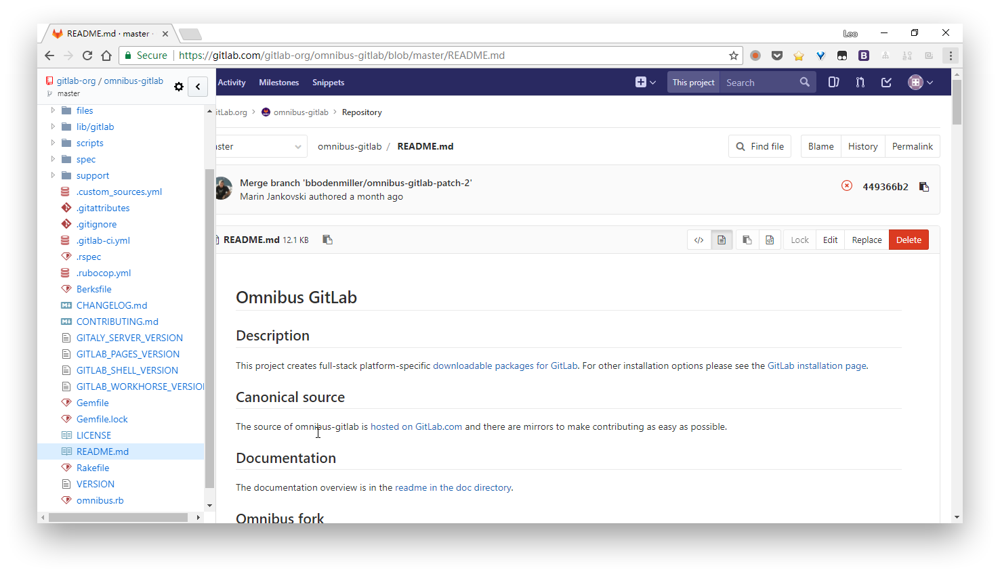

## Code tree on Gitee and Gitlab
Browser extension (Chrome) to show a code tree on [Gitee](https://gitee.com/inu1255/GitCodeTree) and [Gitlab](https://gitlab.com/gitlab-org/omnibus-gitlab/blob/master/README.md). Forked from octree. 

 


### Reference
* [Gitee Code Tree](https://gitee.com/inu1255/GitCodeTree)

### Gitlab page limitation
 One compromise solution is loop query all pages.
 ```javascript
  _get(path, opts, cb) {
    const host = location.protocol + '//' + location.host
    const url = `${host}/api/v4/projects/${opts.repo.username}%2F${opts.repo.reponame}${path || ''}`
    const cfg = {url, method: 'GET', cache: false}

    if (opts.token) {
      cfg.headers = {Authorization: 'token ' + opts.token}
    }

    function loadAll(data0, xTotalPages) {
      let data_arr = [data0];
      let count = 1;
      for (let i = 2; i <= xTotalPages; i++) {
        cfg.data = {page: i}
        // cfg.async = false
        $.ajax(cfg)
          .done((data, textStatus, request) => {
            count++;
            if (path && path.indexOf('/git/trees') === 0 && data.truncated) {
              this._handleError({status: 206}, cb)
            } else {
              data_arr[i - 1] = data
              if (count == xTotalPages) {
                const merged = [].concat.apply([], data_arr)
                cb(null, merged)
              }
            }
          })
          .fail((jqXHR) => this._handleError(jqXHR, cb))
      }
    }

    $.ajax(cfg)
      .done((data, textStatus, request) => {
        if (path && path.indexOf('/git/trees') === 0 && data.truncated) {
          this._handleError({status: 206}, cb)
        }
        else {
          const xTotalPages = request.getResponseHeader('X-Total-Pages');
          if (xTotalPages > 1) {
            loadAll(data, xTotalPages);
            return
          }
          cb(null, data)
        }
      })
      .fail((jqXHR) => this._handleError(jqXHR, cb))
  }
 ```

### Gitlab alternatives
* __[gitlab code view](https://chrome.google.com/webstore/detail/gitlab-code-view/gglalfcdiahpedikbmegmmkmpmajnpjj)__: No source code found

### Other Git Service
* __[gitbucket](https://gitbucket.github.io/)__: [gitbucket-explorer-plugin](https://github.com/gitbucket-plugins/gitbucket-explorer-plugin)
* __[gitea](https://gitbucket.github.io/)__: No tree api